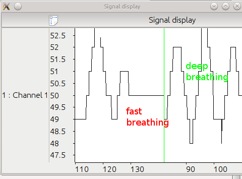

Using BLE connectivity from smartwatch (and other compatible devices) to stream physiological signals to computer.

Requires [bluepy](https://github.com/IanHarvey/bluepy) and [LSL](https://github.com/sccn/labstreaminglayer), install (the right versions) with `pip install -r requirements.txt`.

# Dev

Note: the repository is using git subrepo to handle some dependencies (e.g. GattDevice) -- see https://github.com/ingydotnet/git-subrepo
